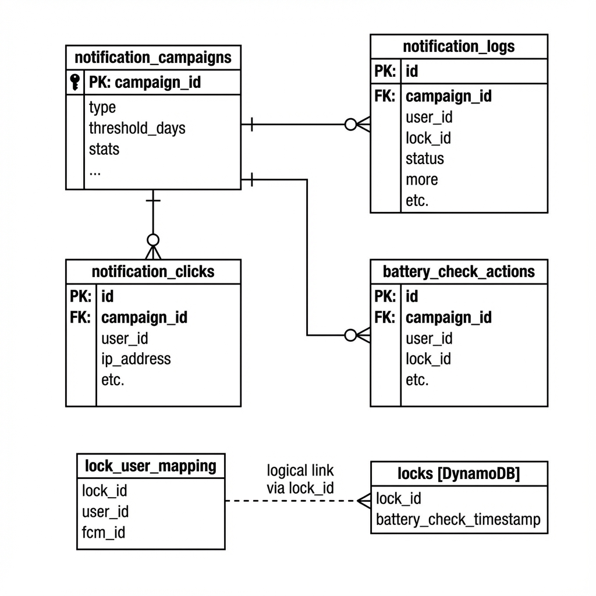

# Battery Notification Service

Node.js script that sends FCM notifications to users who haven't checked their lock's battery in the last month. Runs weekly and tracks campaign effectiveness.

## Key Features

-   **Scalable Querying**: Uses DynamoDB scans (simulated for assignment) and batched PostgreSQL queries to handle large datasets without crashing.
-   **Effectiveness Measurement**: Tracks "Click-Through Rate" (CTR) and "Conversion Rate" (users who actually checked the battery after notification).
-   **Robust Error Handling**: The script is designed to continue processing batches even if individual batches fail.

## Design Decisions

-   **DynamoDB Scan vs. Query**: The requirement implies checking *all* locks. A scan is appropriate here for the assignment scope. For production with millions of locks, I would recommend adding a **Global Secondary Index (GSI)** on `battery_check_timestamp` to efficiently query only stale locks.
-   **Postgres Batching**: To avoid hitting the parameter limit in PostgreSQL (often ~65k parameters), user lookups are processed in batches of 1000.
-   **Deep Linking**: The notification sends a unique click tracking URL. This API tracks the click and then redirects the user to `your-app-scheme://battery-check` to open the specific screen in the mobile app.

## Architecture


## Database Schema




## Setup

1.  **Install dependencies**:
    ```bash
    npm install
    ```
2.  **Environment**:
    Copy `.env.example` to `.env` and fill in your credentials.
3.  **Database**:
    Run schema migration:
    ```bash
    psql -f database-schema.sql
    ```
4.  **Firebase**:
    Add your `firebase-service-account.json` to the root directory.

## Usage

**Run the Notification Service (Weekly Job):**
```bash
npm start
# OR: node src/jobs/run-campaign.js
```
*Recommended to schedule this with cron (e.g., every Sunday).*

**Start Click Tracking API:**
```bash
npm run api
# OR: node src/api/server.js
```

**Generate Analytics Report:**
```bash
npm run analytics -- report
# OR: node src/jobs/run-analytics.js report
```

## Reviewer Notes

I have refactored the project into a scalable structure:
- `src/services`: Core business logic.
- `src/api`: Express server.
- `src/jobs`: Standalone scripts/cron jobs.
- `src/config`: Shared configuration.

I have also included a `scripts/test-script.js` which mocks the database interactions. You can run `npm test` to verify the logic flow without needing active DB connections.